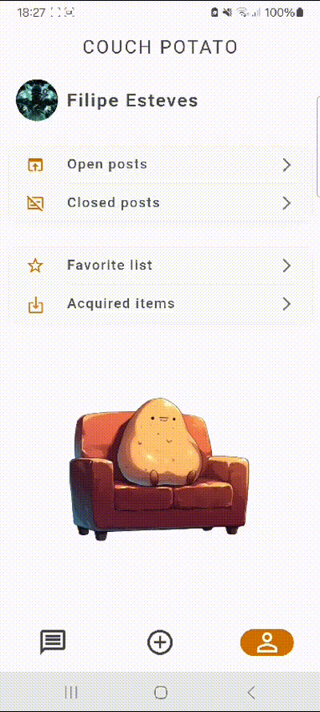
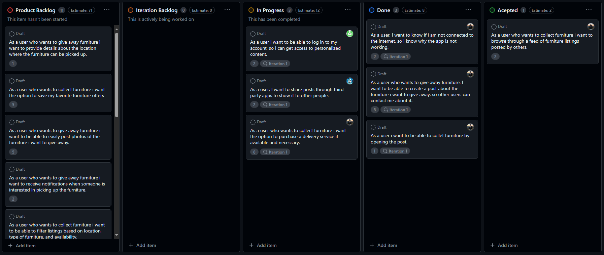
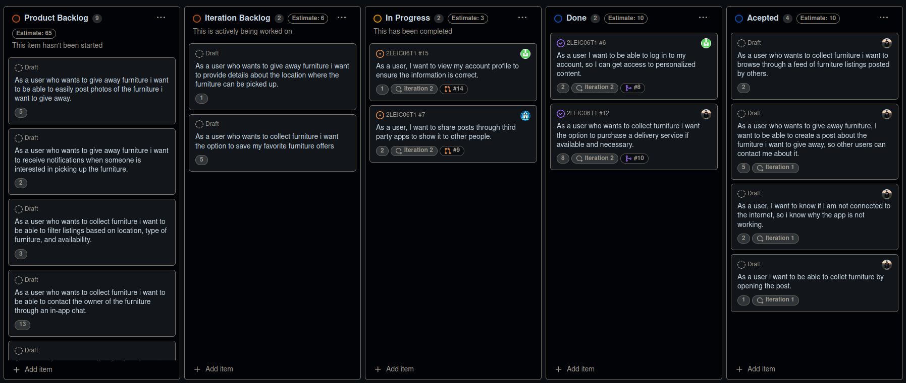
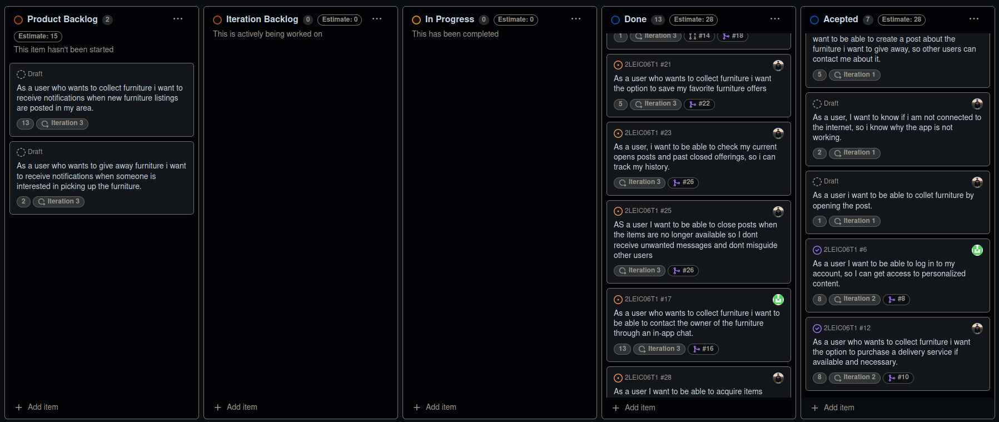

# COUCH POTATO Development Report

Welcome to the documentation pages of the COUCH POTATO!

You can find here details about the COUCH POTATO, from a high-level vision to low-level implementation decisions, a kind of Software Development Report, organized by type of activities:

- [Business modeling](#Business-Modelling)
  - [Product Vision](#Product-Vision)
  - [Features and Assumptions](#Features-and-Assumptions)
  - [Elevator Pitch](#Elevator-pitch)
- [Requirements](#Requirements)
  - [User stories](#User-stories)
  - [Domain model](#Domain-model)
- [Architecture and Design](#Architecture-And-Design)
  - [Logical architecture](#Logical-Architecture)
  - [Physical architecture](#Physical-Architecture)
  - [Vertical prototype](#Vertical-Prototype)
- [Project management](#Project-Management)

Contributions are expected to be made exclusively by the initial team, but we may open them to the community, after the course, in all areas and topics: requirements, technologies, development, experimentation, testing, etc.

Please contact us!

Thank you!

- Afonso Pereira, up202107138
- Filipe Esteves, up202206515
- Guilherme Carvalho, up202005369
- Miguel Charchalis, up201506074
- Tiago Martins, up202206640

## Business Modelling

### Product Vision

Our mission is to develop an innovative application dedicated to making communities and cities more sustainable. Initially, the user will need to authenticate themselves in the application to access its features. Upon entering, the user will have the possibility to publish used furniture that they wish to donate. After publishing a furniture item, the user only has to wait for another user to be interested in the furniture and contact them. The transaction will be done in one of two options:

1. The two users meet at a predetermined location that can be arranged by a chat provided by the application.
2. The user offering the furniture will have access to a transportation service provided by the application that will take the furniture to the interested user's home. This service is paid.

### Features and Assumptions

#### Main Features

1. Scroll through feed
2. See profiles
3. Instant message
4. delivery service options

#### Required APIs

1. Firebase cloud database
2. Firebase OAuth

### Elevator Pitch

## Requirements

### Domain model

- The User contains a name, username, password, email and adrees.
- Each user can have as many posts as he wants posted and can have as many posts in is wish list as well.
- They can also have Chats with other Users were they can send each other messages.
- Each post can be requested to aquire and that requeszt may ou may not have a Delivery Request.
- The Admin can ban Users as well as posts that dont fill the requirements.

## Architecture and Design

### Logical architecture

- **Couch Potato UI** : aplication pages;
- **Couch Potato Business Logic** : manipulation and manegement of User data;
- **FireBase Database Schema** : where some the information of the application is stored;
- **Google Acount** : conects with google services;

### Physical architeture

The Pysical arqchiteture diagram is composed by three nodes, which represent the pysical devices presentin the project.

- The First Node is the Smartphone device, that contains the Couch Potato (Flutter) application component.

- The Second Node is the FireBase Server, that serve as an interface between the Smartphone divice and the Google Server while receiving the user requests and providing the expected services as well, which containd three components:

  1. Couch Potato UI (Dart);
  2. Couch Potato Business Logic (Dart);
  3. Couch Potato Data Base (Firebase Realtime Database);

- The Third Node id the Google Server, were there is information saved about the users Google acount.

### Vertical prototype

<!--#### First Prototype
  -->

  <b>First Prototype</b>  
   

<!-- #### Final Prototype
 

 -->

  <b>Final Prototype</b>  
  
   
  
  

## Project management

### Sprint 1

#### Final Backlog

### Sprint 1 Retrospective

#### What went well?

- The work developed during the sprint was also useful in getting familiarized with the technologies being used.
- High acceptance rate of the features implemented.

#### What could have gone better?

- We were not able to implemented all the issues planned for the sprint.
- There was a need for better tracking of the project's flow, including constant updates to the product backlog and creation of pull requests for each branch.
- We had many problems according to the technologies being used so every element could develop in their own machine from emulator problems to flutter and dart external libraries.

#### What are we going to do to improve?

- Integrate the product backlog more effectively to keep track of changes throughout the sprint and use pull requests to connect branches with user stories.
- Ensure a more universal codebase in the Git repository to facilitate code execution on different machines without encountering environment-specific issues.

### Sprint 2

#### Final Backlog

### Sprint 2 Retrospective

#### What went well?

- Improved implementation of issues and pull requests, leading to better organization of user stories.

#### What could have gone better?

- Continued to face environment-specific issues on some developer's machines.
- Low integration rate of the user stories selected in the product backlog.

#### What are we going to do to improve?

- Modify the shared files in Git to minimize potential issues.
- Enhance the assessment of user story values during sprint planning.

### Sprint 3

#### Final Backlog

### Sprint 3 Retrospective

#### What went well?

- Achieved a high season implementation value.
- Resolved problems related to developing the app on various machines.

#### What could have gone better?

- There was a slight oversight in the use of pull requests on GitHub.
