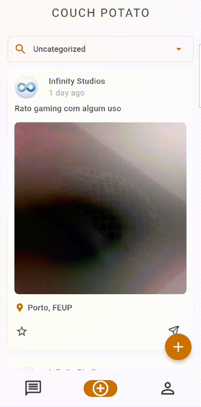

# COUCH POTATO Development Report

Welcome to the documentation pages of the COUCH POTATO!

You can find here details about the COUCH POTATO, from a high-level vision to low-level implementation decisions, a kind of Software Development Report, organized by type of activities:

- [Business modeling](#business-modelling)
  - [Product Vision](#product-vision)
  - [Features and Assumptions](#features-and-assumptions)
  - [Elevator Pitch](#elevator-pitch)
- [Requirements](#requirements)
  - [Domain model](#domain-model)
- [Architecture and Design](#architecture-and-design)
  - [Logical architecture](#logical-architecture)
  - [Physical architecture](#physical-architecture)
  - [Vertical prototype](#vertical-prototype)
- [Project management](#project-management)
  - [Sprint 1](#sprint-1)
  - [Sprint 2](#sprint-2)
  - [Sprint 3](#sprint-3)

Contributions are expected to be made exclusively by the initial team, but we may open them to the community, after the course, in all areas and topics: requirements, technologies, development, experimentation, testing, etc.

Please contact us!

Thank you!

- Afonso Pereira, up202107138
- Filipe Esteves, up202206515
- Guilherme Carvalho, up202005369
- Miguel Charchalis, up201506074
- Tiago Martins, up202206640

## Business Modelling

### Product Vision

Our mission is to develop an innovative application dedicated to making communities and cities more sustainable. Initially, the user will need to authenticate themselves in the application to access its features. Upon entering, the user will have the possibility to publish used furniture that they wish to donate. After publishing a furniture item, the user only has to wait for another user to be interested in the furniture and contact them. The transaction will be done in one of two options:

1. The two users meet at a predetermined location that can be arranged by a chat provided by the application.
2. The user offering the furniture will have access to a transportation service provided by the application that will take the furniture to the interested user's home. This service is paid.

### Features and Assumptions

#### Main Features

1. Scroll through feed
2. See profiles
3. Instant message
4. delivery service options

#### Required APIs

1. Firebase cloud database
2. Firebase OAuth

#### Definition of Done (DoD)

A task is considered done when:

1. The code for the task is fully implemented and checked into the main branch.
2. The code has been reviewed by at least one other team member.
3. All automated unit tests associated with the task pass successfully.
4. All acceptance tests associated with the task pass successfully.
5. The feature implemented by the task is fully functional in the latest build of the application.

#### Definition of Ready (DoR)

A task is considered ready to be worked on when:

1. The task is clearly defined and has a well-understood acceptance criteria.
2. The task is estimated and has been prioritized in the backlog.
3. Any dependencies of the task have been identified and are available.
4. The task is not blocked by another task.
5. The team has all the necessary information to start work on the task.

### Elevator Pitch
Imagine a world where the items you no longer use can instantly find a new home with someone who needs them. Introducing Couch Potato, the revolutionary app that transforms decluttering into a seamless, rewarding experience. With Couch Potato, you can easily list items you want to give away, directly message interested recipients, and even create a wishlist of your favorite finds. It's not just about getting rid of stuff; it's about connecting people, reducing waste, and sharing resources. Couch Potato turns your unused items into someone else's treasure, fostering a community of giving and sustainability. Join us and revolutionize your perspective on unused items forever.
## Requirements

### Domain model

- `User`: Each user is identified by a unique username and has personal information such as name, password, email, and address. 
- `Posts`: Users can create multiple posts. Each post is associated with the user who created it.
- `Wishlist`: Users can add multiple posts to their wishlist. The wishlist is a collection of posts that a user is interested in.
- `Chat`: Users can engage in chats with other users. Each chat consists of multiple messages exchanged between users.
- `Request`: Users can request to acquire a post. Each request is associated with a post and may optionally include a delivery request.
- `Admin`: Admins have the ability to ban users and posts that do not meet the platform's requirements.

## Architecture and Design

### Logical architecture

- **Couch Potato UI**: This component represents the application's user interface. It includes all the pages that users interact with.
- **Couch Potato Business Logic**: This component is responsible for the manipulation and management of user data. It contains the logic that drives the application's functionality.
- **FireBase Database Schema**: This is where some of the application's information is stored. It represents the structure of the data within Firebase, our chosen database solution.
- **Google Account**: This component connects with Google services. It allows users to authenticate using their Google accounts, providing a seamless sign-in experience.

### Physical Architecture

The Physical architecture diagram is composed by three nodes, which represent the physical devices presenting the project.

- The First Node is the Smartphone device, that contains the Couch Potato (Flutter) application component. This includes three main components:

  1. Couch Potato (Flutter);
  2. Couch Potato UI (Dart);
  3. Couch Potato Business Logic (Dart);

- The Second Node is the FireBase Server, that serves as an interface between the Smartphone device and the Google Server while receiving the user requests and providing the expected services. It contains the Couch Potato Database (Firebase Realtime Database).

- The Third Node is the Google Server, where information about the users' Google accounts is saved.

### Vertical prototype

<!--#### First Prototype
  -->

  <b>First Prototype</b>  
   

<!-- #### Final Prototype
 

 -->

  <b>Final Prototype</b>  
  
   
  
  

## Project management

### Sprint 1

#### Final Backlog

### Sprint 1 Retrospective

#### What went well?

- The work developed during the sprint was also useful in getting familiarized with the technologies being used.
- High acceptance rate of the features implemented.

#### What could have gone better?
- We did not fully comply with our Definition of Done (DoD) for some tasks. This led to some tasks being accepted before they were fully tested.
- We were not able to implemented all the issues planned for the sprint.
- There was a need for better tracking of the project's flow, including constant updates to the product backlog and creation of pull requests for each branch.
- We had many problems according to the technologies being used so every element could develop in their own machine from emulator problems to flutter and dart external libraries.

#### What are we going to do to improve?

- Integrate the product backlog more effectively to keep track of changes throughout the sprint and use pull requests to connect branches with user stories.
- Ensure a more universal codebase in the Git repository to facilitate code execution on different machines without encountering environment-specific issues.
- We will enhance our compliance with the Definition of Done (DoD) to guarantee that all tasks are thoroughly completed and tested prior to acceptance.
### Sprint 2

#### Final Backlog

### Sprint 2 Retrospective

#### What went well?

- Improved implementation of issues and pull requests, leading to better organization of user stories.

#### What could have gone better?
- We did not fully comply with our Definition of Done (DoD) for some tasks. This led to some tasks being accepted before they were fully tested.
- Continued to face environment-specific issues on some developer's machines.
- Low integration rate of the user stories selected in the product backlog.

#### What are we going to do to improve?
- We will enhance our compliance with the Definition of Done (DoD) to guarantee that all tasks are thoroughly completed and tested prior to acceptance.
- Modify the shared files in Git to minimize potential issues.
- Enhance the assessment of user story values during sprint planning.

### Sprint 3

#### Final Backlog

### Sprint 3 Retrospective

#### What went well?

- Achieved a high season implementation value.
- Resolved problems related to developing the app on various machines.

#### What could have gone better?

- There was a slight oversight in the use of pull requests on GitHub.
